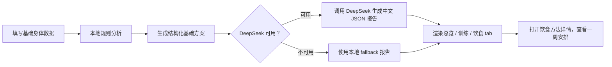
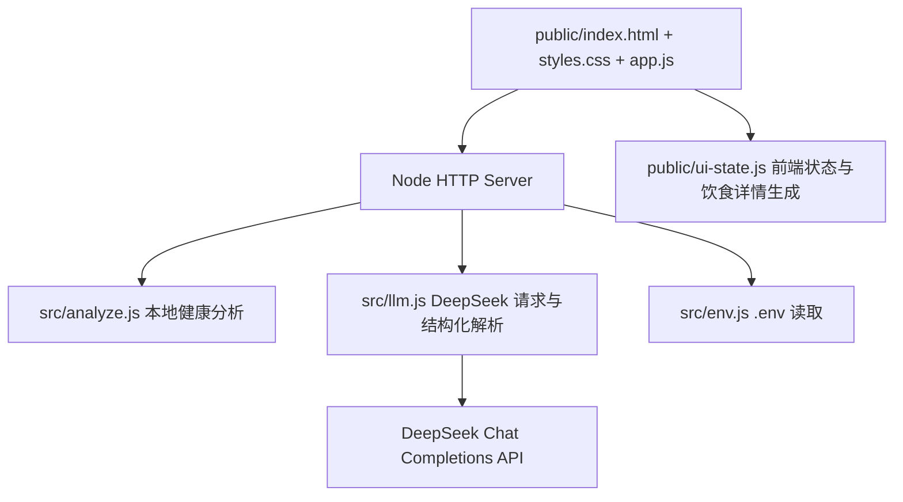

# FitSense LocalAI


FitSense LocalAI 是一个面向个人训练与饮食规划的本地优先健康分析工作台。它用清晰的身体数据输入、结构化训练模块、饮食策略推荐和 DeepSeek 中文报告生成，把“我要怎么练、怎么吃、怎么坚持”整理成可执行的一页式方案。

项目在线预览：[https://rushskd.github.io/FitSense_LocalAI/](https://rushskd.github.io/FitSense_LocalAI/)

> GitHub Pages 版本用于静态界面预览。完整的 `/api/analyze`、DeepSeek 代理、服务端 `.env` 配置能力需要运行本地 Node 服务，或后续接入独立后端。

## 项目亮点

| 能力 | 说明 |
| --- | --- |
| 本地优先分析 | 即使没有 DeepSeek API Key，也能基于本地规则生成 BMI、活动评分、训练方向和饮食建议。 |
| DeepSeek 增强报告 | 支持服务端 `.env` API Key，也支持用户在浏览器中临时填写自己的 Key，通过本地代理生成结构化中文报告。 |
| 训练与饮食分模块 | 报告被拆分为总览、训练预设、饮食策略三个 tab，避免大段文本堆在一起。 |
| 多套训练预设 | 根据减脂、增肌、耐力、综合健康等目标，生成不同训练计划和推荐程度。 |
| 科学饮食方法 | 内置碳水渐降、中低碳高蛋白、生酮饮食等方法，并给出适用边界和谨慎提示。 |
| 一周饮食详情 | 每种饮食策略都可以展开详情页，查看一周执行安排、原则、训练配合和风险提醒。 |
| Liquid Glass 视觉 | 使用 SVG filter、玻璃拟态、动态折射和局部悬浮控件，呈现更接近现代 iOS 风格的界面体验。 |
| 零前端框架 | 使用原生 HTML、CSS、JavaScript 和 Node.js，结构直观，部署轻量，适合继续二次开发。 |

## 视觉与交互

FitSense LocalAI 的界面不是传统表单工具，而是一个偏产品化的健康分析仪表台。

| 区域 | 设计目标 |
| --- | --- |
| Hero 区 | 用大标题、液态玻璃胶囊和柔和背景纹理建立第一视觉焦点。 |
| 输入区 | 保留核心身体数据字段，降低用户填写成本。 |
| 概览区 | 将 BMI、活动评分、目标方向等基础指标卡片化。 |
| 报告区 | 用 tab 拆分报告，训练和饮食分别承载，不再把生成结果挤成一团。 |
| DeepSeek 浮窗 | 在线能力状态被做成右下角悬浮模块，展开时只增强自身背后的动态模糊，不影响主页面布局。 |
| 饮食详情页 | 每个饮食方法有独立详情层，适合展示更完整的一周计划。 |

## 工作流程



## 技术架构



| 路径 | 作用 |
| --- | --- |
| `public/index.html` | 页面结构、SVG 玻璃滤镜、报告 tab、饮食详情弹层。 |
| `public/styles.css` | Liquid Glass 视觉系统、响应式布局、tab 动效、悬浮 DeepSeek 面板。 |
| `public/app.js` | 表单提交、API 状态、报告渲染、tab 切换、饮食详情交互。 |
| `public/ui-state.js` | 前端派生状态、评分逻辑、饮食方法一周详情。 |
| `src/analyze.js` | 本地 BMI、训练建议、饮食策略、fallback 结构化计划。 |
| `src/llm.js` | DeepSeek 配置解析、请求体构建、JSON 报告解析和兜底。 |
| `server.js` | 静态资源服务、`/api/status`、`/api/analyze`。 |
| `test/` | Node 原生测试，覆盖分析逻辑、DeepSeek 请求、布局约束和 UI 状态。 |

## 本地运行

环境要求：

| 工具 | 版本建议 |
| --- | --- |
| Node.js | 18 或更高版本，推荐 20+ |
| npm | 仅用于运行脚本，本项目没有第三方依赖 |

启动项目：

```bash
git clone https://github.com/Rushskd/FitSense_LocalAI.git
cd FitSense_LocalAI
npm start
```

打开浏览器访问：

```text
http://localhost:3000/
```

运行测试：

```bash
npm test
```

如果当前环境 npm 不可用，也可以直接运行：

```bash
node --test
```

## DeepSeek 配置

项目支持两种 API Key 使用方式。

| 方式 | 适合场景 | 说明 |
| --- | --- | --- |
| 服务端 `.env` | 自己本地长期使用 | Key 放在本地 `.env`，由 Node 服务代理请求，不暴露到页面源码。 |
| 浏览器填写 | 临时体验或给用户自备 Key | Key 存在当前浏览器 localStorage，提交分析时传给本地 Node 代理。 |

创建 `.env`：

```bash
cp .env.example .env
```

填写配置：

```env
DEEPSEEK_API_KEY=your_deepseek_api_key
DEEPSEEK_MODEL=deepseek-v4-flash
DEEPSEEK_API_URL=https://api.deepseek.com/chat/completions
PORT=3000
```

接口说明：

| 接口 | 方法 | 说明 |
| --- | --- | --- |
| `/api/status` | `GET` | 返回 DeepSeek 是否已配置、当前模型、是否支持浏览器 Key。 |
| `/api/analyze` | `POST` | 接收身体数据，返回本地分析、报告来源和结构化报告。 |

## 部署说明

当前仓库已经配置 GitHub Pages 自动部署：

| 文件 | 作用 |
| --- | --- |
| `.github/workflows/pages.yml` | push 到 `main` 后，将 `public/` 上传为 GitHub Pages 静态站点。 |
| `index.html` | 根目录静态跳转，用于兼容仓库根路径访问。 |
| `public/` | 实际前端页面与静态资源。 |

静态部署适合展示界面、交互动效和页面结构。因为 GitHub Pages 不运行 Node 服务，在线地址默认不能提供 `/api/analyze` 后端能力。若要让外网完整调用 DeepSeek，可以继续部署一个 Node 后端到 Render、Railway、Vercel Serverless、Cloudflare Workers 或自己的服务器，再把前端 API 地址指向该后端。

## 安全与边界

FitSense LocalAI 是健康规划辅助工具，不是医疗诊断系统。

| 边界 | 说明 |
| --- | --- |
| API Key | 不要把真实 Key 提交到 GitHub；`.env` 已被 `.gitignore` 忽略。 |
| 浏览器 Key | 用户在页面填写的 Key 仅保存在当前浏览器 localStorage，但仍应只在可信环境中使用。 |
| 健康建议 | 报告适合训练和饮食规划参考，不替代医生、营养师或康复师建议。 |
| 特殊人群 | 孕期、慢性病、肾病、糖尿病、进食障碍、长期服药等情况，应先咨询专业人士。 |
| 生酮与低碳 | 页面会给出谨慎提示，不把生酮作为默认推荐，尤其不建议高强度训练较多时贸然采用。 |

## 测试覆盖

当前测试重点覆盖：

| 测试文件 | 覆盖内容 |
| --- | --- |
| `test/analyze.test.js` | BMI、目标判断、本地结构化训练与饮食方案。 |
| `test/llm.test.js` | DeepSeek 配置解析、请求体构建、结构化 JSON 解析和 fallback。 |
| `test/ui-state.test.js` | 前端评分、报告来源状态、饮食详情一周计划。 |
| `test/report-layout.test.js` | 原始回包隐藏、饮食详情入口、GitHub Pages 路径、tab 与悬浮模块布局约束。 |

## 路线图

| 优先级 | 方向 |
| --- | --- |
| P0 | 修复历史中文文案编码显示，统一为标准 UTF-8。 |
| P1 | 增加真实外网后端部署，让 GitHub Pages 预览也能完整生成 DeepSeek 报告。 |
| P1 | 增加报告导出为 Markdown、PDF 或图片卡片。 |
| P2 | 支持更多训练目标，如塑形、体态改善、康复后恢复训练。 |
| P2 | 增加用户历史记录、本地多方案对比和周期化训练追踪。 |
| P3 | 为饮食模块加入更多可配置参数，如餐次、忌口、预算、外食频率。 |

## License

本项目基于 [MIT License](./LICENSE) 开源。
